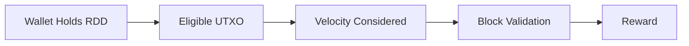

# Architecture Overview

## PoSV v2 Flow

```mermaid
flowchart LR
  A[Wallet Holds RDD] --> B[Eligible UTXO]
  B --> C[Velocity Considered]
  C --> D[Block Validation]
  D --> E[Reward]
```

## ReddID Flow

```mermaid
flowchart LR
  A[User Chooses Name] --> B[Namespace Check]
  B --> C[Cost Calculated]
  C --> D[Transaction]
  D --> E[Name → Address Resolution]
```
