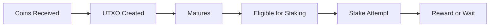
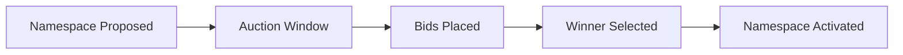

# Technical Deep Dives

## UTXO Lifecycle

```mermaid
flowchart LR
  A[Coins Received] --> B[UTXO Created]
  B --> C[Matures]
  C --> D[Eligible for Staking]
  D --> E[Stake Attempt]
  E --> F[Reward or Wait]
```

## Namespace Auction Lifecycle

```mermaid
flowchart LR
  A[Namespace Proposed] --> B[Auction Window]
  B --> C[Bids Placed]
  C --> D[Winner Selected]
  D --> E[Namespace Activated]
```
