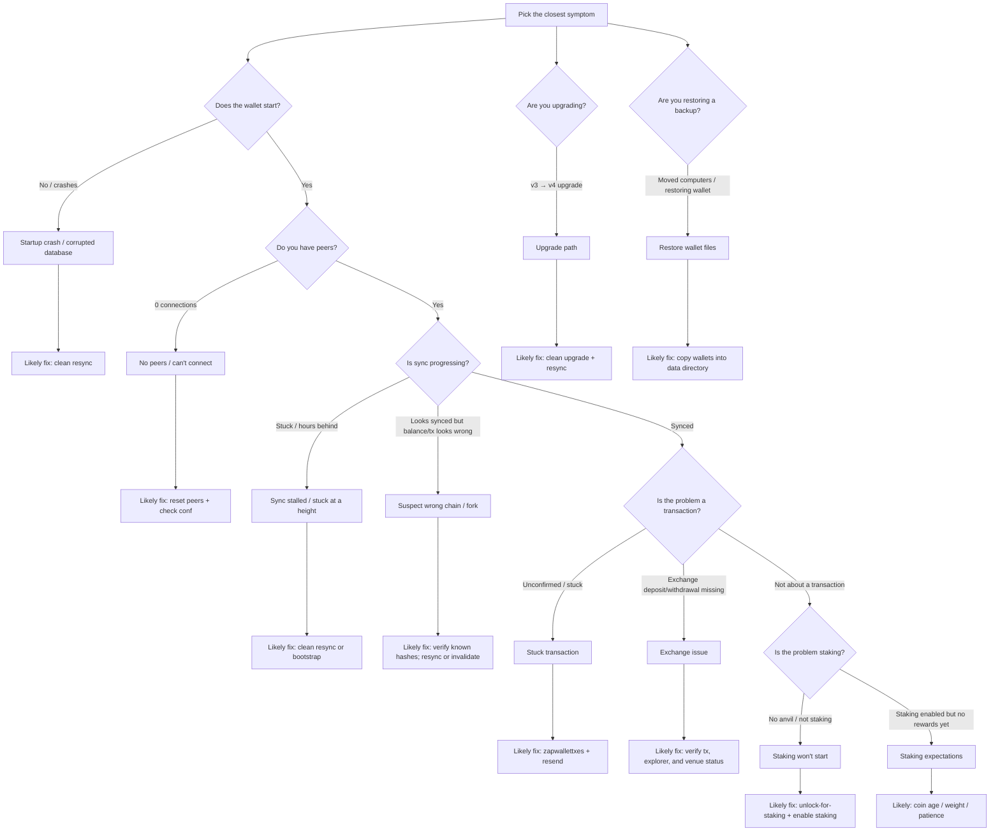

# Troubleshooting decision tree

--8<-- "_includes/safety-banner.md"

If you prefer a guided flow (instead of scanning a table), follow this decision tree.

> **Before you change anything:** make an offline backup of your wallet files (`wallet.dat` and/or the `wallets/` folder). If you’re unsure where those are, see **[Wallet files & locations](../../reference/wallet-files.md)**.

## Go to the matching runbook

- **Startup crash / corrupted database** → [Clean resync (v4)](recipes/clean-resync-v4.md)
- **No peers / 0 connections** → [No peers / connections](recipes/no-peers.md)
- **Sync stalled / stuck** → [Clean resync (v4)](recipes/clean-resync-v4.md) and/or [Bootstrap (v4)](bootstrap.md)
- **Wrong chain / fork** → [Wrong fork / chain split](recipes/wrong-fork-chain-split.md)
- **Stuck transaction** → [Stuck transaction (zapwallettxes)](recipes/stuck-transaction-zapwallettxes.md)
- **Exchange deposits/withdrawals** → [Exchange deposits/withdrawals](recipes/exchange-deposits-withdrawals.md)
- **Staking won’t start** → [Staking doesn’t start](recipes/staking-doesnt-start.md)
- **Staking is slow / no wins yet** → [Staking expectations](recipes/staking-expectations.md)
- **v3 → v4 upgrade** → [v3 → v4 upgrade](recipes/v3-to-v4-upgrade.md)
- **Restoring from backup / moving computers** → [Restore wallet files](recipes/restore-wallet-files.md)

If you’re still unsure which branch applies, use: [Quick triage (1–2 clicks)](quick-triage.md)
